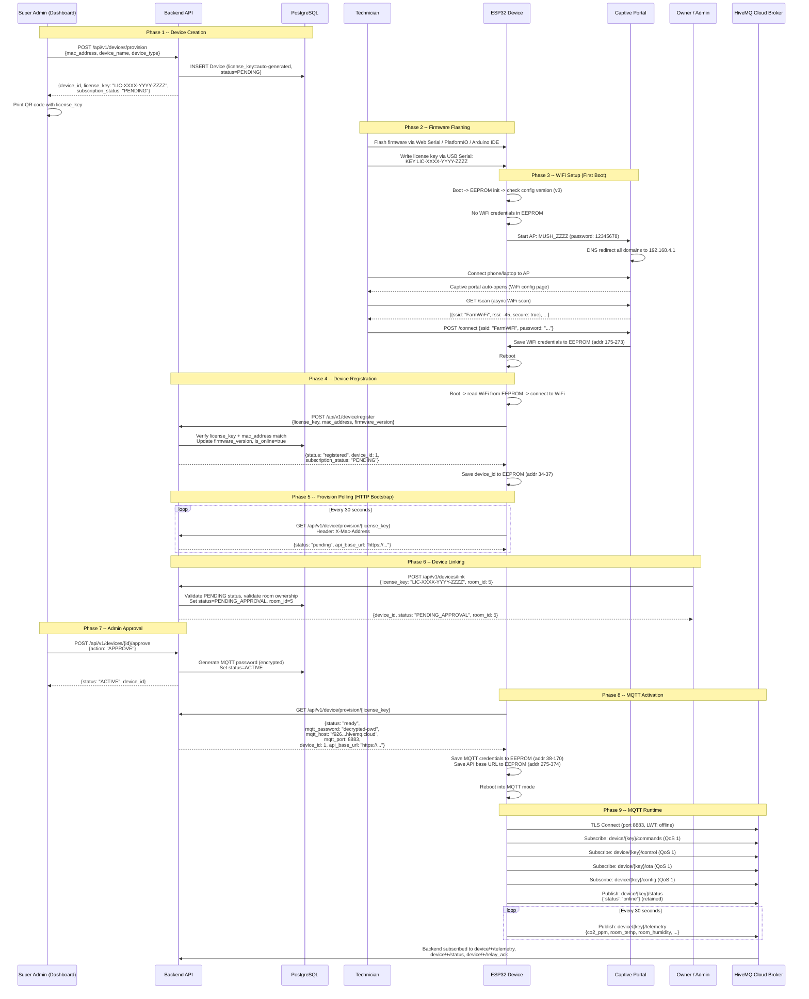
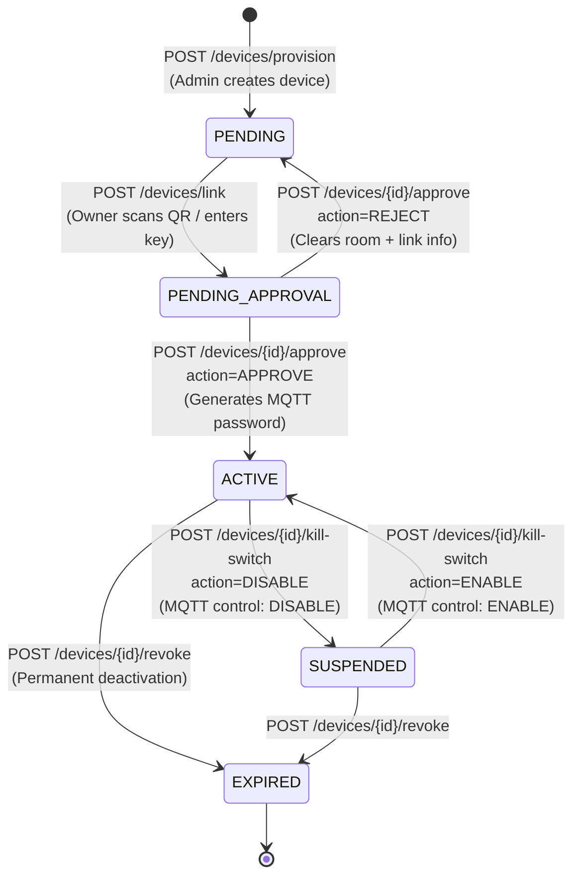
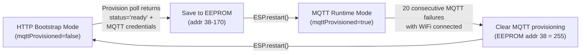

# Device Provisioning & Lifecycle

This document describes the full lifecycle of an ESP32 device in the Mushroom Farm IoT Monitoring platform -- from initial provisioning through active MQTT operation, suspension, and expiry.

---

## 1. Provisioning Sequence Diagram

---

## 2. Subscription Status State Machine

### Status Definitions

| Status | Description | Device Behavior |
|--------|-------------|-----------------|
| `PENDING` | Device created by admin, awaiting owner link | ESP32 polls `/device/provision/{key}` -- receives `status: "pending"` |
| `PENDING_APPROVAL` | Owner linked device to a room, awaiting admin approval | ESP32 polls -- receives `status: "pending_approval"` |
| `ACTIVE` | Approved with MQTT credentials generated | ESP32 polls -- receives `status: "ready"` + MQTT creds, reboots to MQTT mode |
| `SUSPENDED` | Temporarily disabled via kill-switch | ESP32 receives MQTT `DISABLE` command, turns off all relays |
| `EXPIRED` | Permanently revoked | Device deactivated (`is_active=false`), cannot be re-enabled |

---

## 3. Communication Mode Transition

### HTTP Bootstrap Mode

In this mode, the ESP32 uses HTTP endpoints for all communication:

- **POST** `/device/register` -- authenticate with license_key + mac_address
- **POST** `/device/readings` -- send sensor data (X-Device-Id + X-Device-Key headers)
- **POST** `/device/heartbeat` -- health check with IP, RSSI, heap, uptime
- **GET** `/device/{id}/commands` -- poll for pending relay commands (Redis queue)
- **GET** `/device/provision/{license_key}` -- poll for MQTT credentials (every 30s)

### MQTT Runtime Mode

After MQTT provisioning, all real-time communication switches to MQTT:

- Telemetry published every 30 seconds to `device/{key}/telemetry`
- Relay commands received via `device/{key}/commands` subscription
- Kill-switch via `device/{key}/control` subscription
- OTA updates via `device/{key}/ota` subscription
- Threshold config sync via `device/{key}/config` subscription

---

## 4. API Endpoints Reference

### Device API (ESP32 calls these) -- prefix: `/api/v1/device`

| Method | Endpoint | Auth | Description | Request | Response |
|--------|----------|------|-------------|---------|----------|
| POST | `/register` | None (rate-limited: 5/min) | Register device with license_key + MAC | `{"license_key": "LIC-SIJT-EJZQ-Q4YV", "mac_address": "C8:F0:9E:A6:2A:84", "firmware_version": "4.0.0"}` | `{"status": "registered", "device_id": 1, "device_name": "Device-1", "subscription_status": "PENDING"}` |
| GET | `/provision/{license_key}` | Rate-limited: 10/min | Poll provisioning status | Header: `X-Mac-Address` (optional) | See provisioning response table below |
| POST | `/readings` | X-Device-Id + X-Device-Key | Submit sensor reading | `{"co2_ppm": 1150, "room_temp": 22.5, "room_humidity": 88.3, "bag_temps": [21.2, 21.8], "outdoor_temp": 28.1, "outdoor_humidity": 65.0, "relay_states": {"co2": true, "humidity": false, ...}}` | `{"status": "success", "reading_id": 42, "timestamp": "2026-03-11T14:30:00Z"}` |
| POST | `/heartbeat` | X-Device-Id + X-Device-Key | Device health check | `{"device_ip": "192.168.29.52", "wifi_rssi": -45, "free_heap": 180000, "uptime_seconds": 86400}` | `{"status": "success", "server_time": "2026-03-11T14:30:00Z"}` |
| GET | `/{device_id}/commands` | X-Device-Id + X-Device-Key | Poll pending relay commands | -- | `{"commands": [{"relay_type": "CO2", "state": "ON"}]}` |

### Provisioning Response by Status

| Device Status | Response `status` field | Additional Fields |
|---------------|------------------------|-------------------|
| PENDING | `"pending"` | `api_base_url` |
| PENDING_APPROVAL | `"pending_approval"` | `message`, `api_base_url` |
| ACTIVE (with password) | `"ready"` | `mqtt_password`, `mqtt_host`, `mqtt_port`, `device_id`, `api_base_url` |
| SUSPENDED | `"suspended"` | `api_base_url` |
| EXPIRED | `"expired"` | `api_base_url` |

### Devices Management API (Dashboard calls these) -- prefix: `/api/v1/devices`

| Method | Endpoint | Role Required | Description | Request Body |
|--------|----------|---------------|-------------|-------------|
| POST | `/provision` | SUPER_ADMIN, ADMIN | Create new device | `{"mac_address": "C8:F0:9E:A6:2A:84", "device_name": "Fruiting Room 1", "device_type": "ESP32"}` |
| POST | `/link` | SUPER_ADMIN, ADMIN | Link device to room via QR/key | `{"license_key": "LIC-SIJT-EJZQ-Q4YV", "room_id": 5}` |
| GET | `/pending-approval` | SUPER_ADMIN, ADMIN | List devices awaiting approval | -- |
| POST | `/{id}/approve` | SUPER_ADMIN, ADMIN | Approve or reject device | `{"action": "APPROVE"}` or `{"action": "REJECT"}` |
| POST | `/{id}/assign` | SUPER_ADMIN, ADMIN | Assign device directly to plant | `{"plant_id": 1}` |
| POST | `/{id}/kill-switch` | SUPER_ADMIN, ADMIN | Enable/disable device remotely | `{"action": "DISABLE"}` or `{"action": "ENABLE"}` |
| POST | `/{id}/revoke` | SUPER_ADMIN, ADMIN | Permanently revoke device | -- |
| GET | `/` | Authenticated | List devices (filtered by ownership) | -- |
| GET | `/{id}` | Authenticated | Get single device | -- |
| PUT | `/{id}` | ADMIN, MANAGER | Update device (rename, assign room) | `{"device_name": "New Name", "room_id": 3}` |
| DELETE | `/{id}` | ADMIN, SUPER_ADMIN | Soft-delete device | -- |
| POST | `/{id}/qr-image` | SUPER_ADMIN, ADMIN | Upload QR code image (base64) | `{"image": "data:image/png;base64,..."}` |
| GET | `/{id}/qr-image` | Authenticated | Get stored QR code image | -- |

---

## 5. Device Model Fields

| Field | Type | Description |
|-------|------|-------------|
| `device_id` | Integer (PK) | Auto-increment primary key |
| `room_id` | Integer (FK) | Room assignment (nullable until linked) |
| `assigned_to_plant_id` | Integer (FK) | Plant assignment (nullable) |
| `mac_address` | String(17) | Unique MAC address, e.g. `C8:F0:9E:A6:2A:84` |
| `license_key` | String(19) | Unique key: `LIC-XXXX-YYYY-ZZZZ` |
| `device_password` | String(255) | Encrypted MQTT password (Fernet) |
| `device_name` | String(50) | Human-readable name |
| `device_type` | Enum | `ESP32`, `ESP8266`, `ARDUINO`, `PLC` |
| `firmware_version` | String(20) | e.g. `4.0.0` |
| `hardware_version` | String(20) | Hardware revision |
| `device_ip` | String(45) | LAN IP address |
| `wifi_rssi` | Integer | WiFi signal strength (dBm) |
| `free_heap` | Integer | Free heap memory (bytes) |
| `is_online` | Boolean | Updated by telemetry/LWT |
| `last_seen` | DateTime | Last telemetry/heartbeat timestamp |
| `is_active` | Boolean | Soft-delete flag |
| `subscription_status` | Enum | `PENDING`, `PENDING_APPROVAL`, `ACTIVE`, `SUSPENDED`, `EXPIRED` |
| `communication_mode` | Enum | `HTTP` or `MQTT` |
| `linked_by_user_id` | Integer (FK) | User who linked the device |
| `linked_at` | DateTime | When device was linked |
| `qr_code_image` | Text | Base64-encoded QR code image |
| `ota_status` | String(20) | `idle`, `updating`, `success`, `failed` |
| `last_ota_at` | DateTime | Last OTA update timestamp |
| `registered_at` | DateTime | Device creation timestamp |
| `updated_at` | DateTime | Last modification timestamp |
