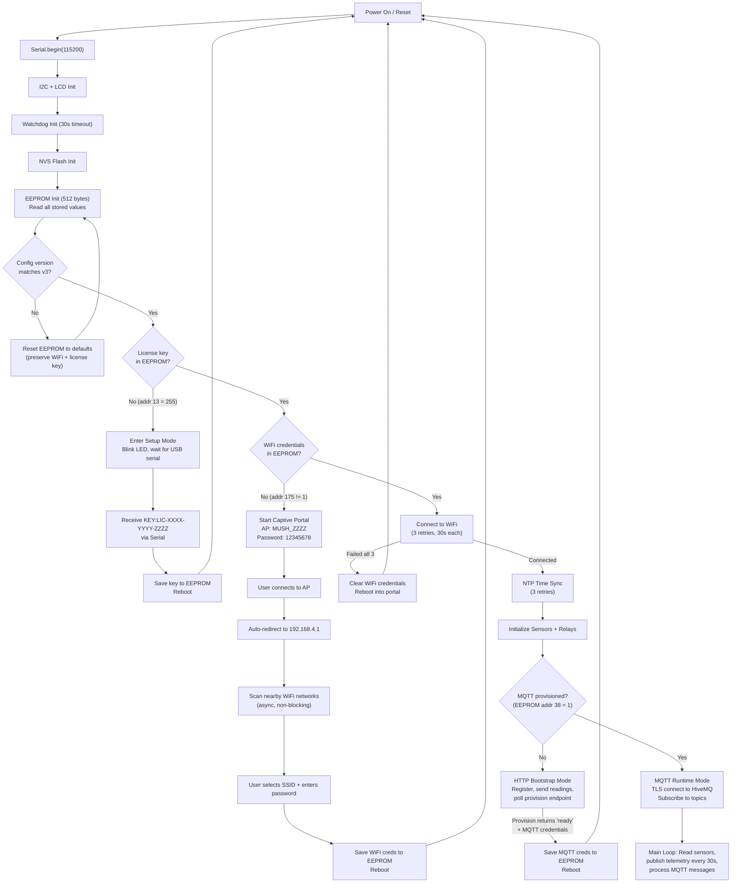

# ESP32 Firmware Flashing & Setup Guide

This guide covers flashing the Mushroom Farm IoT firmware onto an ESP32 DevKit, writing a license key, configuring WiFi via the captive portal, and verifying the device completes provisioning.

---

## Prerequisites

- **Hardware:** ESP32 DevKit V1 (or compatible ESP32 board)
- **USB Cable:** Micro-USB or USB-C (depending on board) with data lines (not charge-only)
- **WiFi Network:** 2.4 GHz network with internet access (ESP32 does not support 5 GHz)
- **License Key:** Obtained from the admin dashboard after provisioning a device (format: `LIC-XXXX-YYYY-ZZZZ`)
- **Computer:** macOS, Windows, or Linux with Chrome/Edge (for Web Serial) or PlatformIO/Arduino IDE

---

## Method 1: Web Serial (Browser-Based)

The dashboard includes a browser-based flashing tool at the **Flash Device** page. This uses the `esptool-js` library via the Web Serial API.

### Requirements
- Chrome 89+ or Edge 89+ (Web Serial API support required; Firefox and Safari are not supported)
- ESP32 connected via USB

### Steps

1. Navigate to the **Flash Device** page in the dashboard
2. Click **Connect** -- the browser prompts you to select a serial port
3. Select the ESP32's USB serial port (typically `CP2102` or `CH340`)
4. The tool detects the ESP32 chip and displays MAC address
5. Select the firmware binary file (`.bin`) to flash
6. Click **Flash** -- progress is displayed in the browser
7. After flashing completes, the device reboots automatically

### Writing the License Key via Web Serial

After flashing, the device enters Setup Mode if no license key is found in EEPROM:

1. Open the browser's serial terminal (or use the dashboard's built-in terminal)
2. The device outputs: `=== SETUP MODE ===` followed by `MAC:XX:XX:XX:XX:XX:XX` and `AWAITING_KEY`
3. Send: `KEY:LIC-XXXX-YYYY-ZZZZ` (with your actual license key)
4. Device responds: `KEY_OK:LIC-XXXX-YYYY-ZZZZ`
5. Device reboots and proceeds to WiFi setup

**Available serial commands in Setup Mode:**

| Command | Response | Description |
|---------|----------|-------------|
| `KEY:LIC-XXXX-YYYY-ZZZZ` | `KEY_OK:LIC-...` or `KEY_ERR:Invalid format` | Write license key to EEPROM |
| `PING` | `PONG` | Connection test |
| `MAC` | `MAC:XX:XX:XX:XX:XX:XX` | Get device MAC address |
| `VERSION` | `VERSION:4.0.0` | Get firmware version |

---

## Method 2: PlatformIO CLI

### Requirements
- [PlatformIO Core](https://platformio.org/install/cli) installed
- Python 3.6+

### Steps

```bash
# Clone the repository (if not already done)
cd /path/to/Mushroom_IOT_Monitoring

# Build and upload firmware
cd Firmware
pio run -t upload

# Monitor serial output (optional, for debugging)
pio device monitor -b 115200
```

### PlatformIO Configuration

The project uses these settings (from `platformio.ini`):

| Setting | Value |
|---------|-------|
| **Board** | `esp32dev` |
| **Framework** | `arduino` |
| **Upload Speed** | 921600 baud |
| **Monitor Speed** | 115200 baud |

### Library Dependencies

The firmware depends on these Arduino libraries (managed by PlatformIO):

| Library | Version | Purpose |
|---------|---------|---------|
| `PubSubClient` | 2.8+ | MQTT client (Nick O'Leary) |
| `ArduinoJson` | 6.x | JSON parsing/serialization |
| `Sensirion I2C SCD4x` | -- | SCD41 CO2/temp/humidity sensor |
| `DallasTemperature` | -- | DS18B20 temperature probes |
| `OneWire` | -- | OneWire bus protocol for DS18B20 |
| `DHT sensor library` | -- | DHT11 outdoor temp/humidity |
| `LiquidCrystal I2C` | -- | 20x4 LCD display |
| `Keypad` | -- | Physical keypad input |
| `ESPAsyncWebServer` | -- | Async HTTP server (captive portal + diagnostics) |
| `AsyncTCP` | -- | TCP async transport for web server |
| `AsyncElegantOTA` | -- | Local OTA update via web browser |

---

## Method 3: Arduino IDE

### Board Setup

1. Open Arduino IDE
2. Go to **File > Preferences**
3. Add ESP32 board URL: `https://raw.githubusercontent.com/espressif/arduino-esp32/gh-pages/package_esp32_index.json`
4. Go to **Tools > Board > Boards Manager**, search "ESP32", install `esp32` by Espressif
5. Select **Tools > Board > ESP32 Dev Module**

### Board Settings

| Setting | Value |
|---------|-------|
| Board | ESP32 Dev Module |
| Upload Speed | 921600 |
| CPU Frequency | 240 MHz |
| Flash Frequency | 80 MHz |
| Flash Mode | QIO |
| Flash Size | 4MB (32Mb) |
| Partition Scheme | Default 4MB with spiffs (or OTA-compatible) |
| PSRAM | Disabled |

### Install Libraries

Install all libraries listed in the PlatformIO section above via **Sketch > Include Library > Manage Libraries**.

### Compile and Upload

1. Open `Firmware/src/main/main.ino` in Arduino IDE
2. Ensure all `.ino` files in the same directory are included (Arduino IDE auto-includes them)
3. Click **Upload** (or Ctrl+U)

---

## EEPROM Layout

The firmware uses 512 bytes of EEPROM for persistent configuration. The layout is version-controlled (`CONFIG_VERSION = 3`); a version mismatch triggers automatic reset while preserving WiFi credentials and the license key.

| Address | Size (bytes) | Type | Description |
|---------|-------------|------|-------------|
| 0 | 1 | bool | CO2 relay status (on/off) |
| 1 | 1 | bool | Humidity relay status |
| 2 | 1 | bool | AC (temperature) relay status |
| 3-4 | 2 | uint16_t | CO2 minimum threshold (ppm, default: 1200) |
| 5-8 | 4 | float | Temperature minimum threshold (Celsius, default: 16.0) |
| 9-12 | 4 | float | Humidity minimum threshold (%RH, default: 90.0) |
| 13-33 | 21 | string | License key (1 byte length + up to 20 chars: `LIC-XXXX-YYYY-ZZZZ`) |
| 34-37 | 4 | int | Device ID (assigned by backend on registration) |
| 38 | 1 | uint8_t | MQTT provisioned flag (0=HTTP mode, 1=MQTT mode, 255=uninitialized) |
| 39-102 | 64 | string | Device MQTT password (null-terminated) |
| 103-166 | 64 | string | MQTT broker hostname (null-terminated) |
| 167-170 | 4 | int | MQTT broker port |
| 171 | 1 | bool | AHU relay status |
| 172 | 1 | bool | Humidifier relay status |
| 173 | 1 | bool | Duct fan relay status |
| 174 | 1 | bool | Extra relay status |
| 175 | 1 | uint8_t | WiFi provisioned flag (0=no, 1=yes, 255=uninitialized) |
| 176-208 | 33 | string | WiFi SSID (1 byte length + up to 32 chars) |
| 209-273 | 65 | string | WiFi password (1 byte length + up to 64 chars) |
| 274 | 1 | uint8_t | Config version (currently 3) |
| 275-374 | 100 | string | API base URL (1 byte length + up to 99 chars) |
| 375-511 | 137 | -- | Reserved / unused |

**Total EEPROM:** 512 bytes (`EEPROM_MEMORY_SIZE`)

---

## First Boot Sequence

The following diagram shows the full boot sequence after flashing:



### Step-by-Step

1. **EEPROM Init:** Read 512 bytes. Check config version at address 274.
   - If mismatch: clear EEPROM, preserve WiFi + license key, write defaults, re-read.

2. **License Key Check:** Read address 13. If 255 (empty), enter Setup Mode.
   - Setup Mode: blink LED on GPIO 2, wait for USB serial command `KEY:LIC-...`, save to EEPROM, reboot.

3. **WiFi Credentials Check:** Read address 175.
   - If not provisioned (0 or 255): start captive portal in AP+STA mode.
   - AP name: `MUSH_` + last 4 chars of license key (e.g. `MUSH_Q4YV`).
   - AP password: `12345678` (fixed, minimum 8 chars for ESP32 softAP).
   - DNS server redirects all domains to `192.168.4.1`.
   - User connects, selects WiFi, credentials saved to EEPROM, device reboots.

4. **WiFi Connection:** Connect to stored SSID/password with 3 retries (30 seconds each).
   - If all retries fail: clear stored credentials and reboot into captive portal.
   - On success: start local HTTP server (port 80) with diagnostic endpoints.

5. **NTP Sync:** Configure time with `pool.ntp.org` (GMT+5:30 IST). 3 retries.
   - Telemetry/HTTP data sending is blocked until NTP succeeds (timestamps must be valid).

6. **Sensor/Relay Init:** Initialize SCD41 (CO2), DS18B20 (bag temps), DHT11 (outdoor), relays (GPIO pins), LCD display, keypad.

7. **Mode Selection:**
   - **HTTP Bootstrap (mqttProvisioned=false):** Register with backend, send readings via HTTP POST, poll `/device/provision/{key}` every 30 seconds. When provisioning returns `"ready"` with MQTT credentials, save to EEPROM and reboot.
   - **MQTT Runtime (mqttProvisioned=true):** Connect to HiveMQ Cloud via TLS (port 8883), subscribe to command topics, publish telemetry every 30 seconds.

---

## Troubleshooting

### WiFi Issues

| Problem | Cause | Solution |
|---------|-------|----------|
| Captive portal does not appear | AP password too short | Firmware uses `12345678` (8 chars min). If using custom firmware, ensure >= 8 chars |
| Cannot connect to portal | Phone on 5 GHz | ESP32 only supports 2.4 GHz. Ensure phone is not on 5 GHz-only mode |
| WiFi connects but no internet | DNS failure on local network | Check router DNS settings. Railway hostname resolution may intermittently fail on some routers |
| WiFi fails after 3 retries | Wrong credentials stored | Device auto-clears credentials and reboots into captive portal |
| WiFi keeps disconnecting | Weak signal | Check `wifi_rssi` in diagnostics. Below -80 dBm is problematic. Use WiFi extender or move device closer |

### MQTT Issues

| Problem | Cause | Solution |
|---------|-------|----------|
| MQTT TLS connect fails | Certificate verification | Firmware uses `setInsecure()` to skip cert verification. If using custom CA, mount cert to ESP32 |
| MQTT fails 20 times, reboots to HTTP | Stale credentials after password change | Normal behavior -- device re-provisions via HTTP bootstrap |
| MQTT connected but no data on dashboard | Backend not subscribed | Check backend MQTT connection logs. Verify `MQTT_BROKER_HOST` and `MQTT_USE_TLS` env vars |
| `rc=-2` on MQTT connect | DNS resolution failure | Router DNS may not resolve HiveMQ hostname. Try setting static DNS (8.8.8.8) on router |

### Sensor Issues

| Problem | Cause | Solution |
|---------|-------|----------|
| CO2 reads 0 or `nan` | SCD41 not connected or NACK | Check I2C wiring: SDA=GPIO21, SCL=GPIO22. Run I2C scanner sketch |
| Bag temps show 0 devices | DS18B20 not wired | Check OneWire buses: Bus 1=GPIO0, Bus 2=GPIO17. Ensure 4.7k pull-up resistor |
| Outdoor temp reads `nan` | DHT11 not connected | Check GPIO 5 wiring. DHT11 requires 3.3V power and data pull-up |

### General Issues

| Problem | Cause | Solution |
|---------|-------|----------|
| Device resets every 30 seconds | Watchdog timeout | Some operation is blocking longer than 30s. Check serial logs for which step hangs |
| "Config Reset..." on every boot | EEPROM corruption | Flash firmware again. If persistent, EEPROM flash sector may be worn -- try `EEPROM.begin()` with different size |
| LCD shows garbled text | Wrong I2C address | Default is `0x27`. Try `0x3F`. Use I2C scanner to find correct address |
| Setup Mode loops | License key not saved | Ensure you send the full key with `KEY:` prefix, format `LIC-XXXX-YYYY-ZZZZ` (exactly 18 chars after prefix) |

### Diagnostic Endpoints

When the device is connected to WiFi (in either HTTP or MQTT mode), it runs a local HTTP server on port 80:

| Endpoint | Description |
|----------|-------------|
| `http://{device_ip}/` | Returns `MUSHROOM DEVICE ONLINE` (connection test) |
| `http://{device_ip}/sensors` | Full JSON dump of all sensor values, relay states, device status |
| `http://{device_ip}/update` | ElegantOTA web interface for local firmware update (no MQTT needed) |

**Example `/sensors` response:**
```json
{
  "co2_ppm": 1150,
  "room_temp": 22.5,
  "room_humidity": 88.3,
  "outdoor_temp": 28.1,
  "outdoor_humidity": 65.0,
  "bag_bus1_count": 2,
  "bag_bus2_count": 2,
  "bag_temps": [21.2, 21.8, 22.0, 21.5],
  "wifi_rssi": -45,
  "free_heap": 180000,
  "uptime_s": 86400,
  "mqtt_provisioned": true,
  "device_id": 1,
  "relay_states": {
    "co2": true,
    "humidity": false,
    "temperature": true,
    "ahu": false,
    "humidifier": true,
    "duct_fan": false,
    "extra": false
  }
}
```

---

## Hardware Wiring Reference

### Sensor Connections

| Sensor | Interface | GPIO Pins | Notes |
|--------|-----------|-----------|-------|
| SCD41 (CO2/Temp/Humidity) | I2C | SDA=21, SCL=22 | Address: 0x62 |
| DS18B20 Bus 1 (Bag Temps) | OneWire | GPIO 0 | 4.7k pull-up required |
| DS18B20 Bus 2 (Bag Temps) | OneWire | GPIO 17 | 4.7k pull-up required |
| DHT11 (Outdoor Temp/Humidity) | Digital | GPIO 5 | |
| LCD 20x4 | I2C | SDA=21, SCL=22 | Address: 0x27 (or 0x3F) |
| Joystick X | Analog | GPIO 32 | Menu navigation |
| Joystick Y | Analog | GPIO 33 | Menu navigation |
| Menu Button | Digital | GPIO 26 | Interrupt-driven |

### Relay Connections

| Relay | GPIO | Default State | Controls |
|-------|------|---------------|----------|
| CO2 Exhaust | 16 | OFF (LOW) | CO2 extraction fan |
| Humidity | 23 | OFF (LOW) | Humidity control system |
| Temperature (AC) | 4 | OFF (LOW) | Air conditioning |
| AHU | 13 | OFF (LOW) | Air handling unit |
| Humidifier | 14 | OFF (LOW) | Humidifier |
| Duct Fan | 27 | OFF (LOW) | Duct ventilation |
| Extra | 25 | OFF (LOW) | Spare / user-defined |
