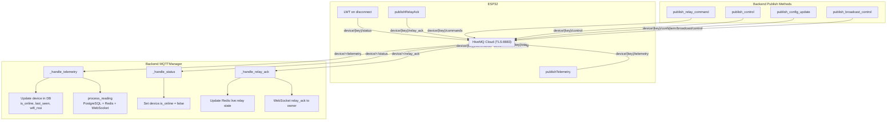

# MQTT Topic Structure & Payload Reference

This document defines every MQTT topic used in the Mushroom Farm IoT platform, including payload formats, QoS levels, retain flags, and which component publishes/subscribes to each topic.

---

## 1. Topic Overview

All device-specific topics follow the pattern: `device/{license_key}/{message_type}`

Where `{license_key}` is the device's unique key in format `LIC-XXXX-YYYY-ZZZZ`.

| Topic | Direction | Publisher | Subscriber | QoS | Retain |
|-------|-----------|-----------|------------|-----|--------|
| `device/{key}/telemetry` | Device -> Broker | ESP32 | Backend | 0 | No |
| `device/{key}/status` | Device -> Broker | ESP32 (LWT) | Backend | 1 | **Yes** |
| `device/{key}/relay_ack` | Device -> Broker | ESP32 | Backend | 0 | No |
| `device/{key}/commands` | Broker -> Device | Backend | ESP32 | 1 | No |
| `device/{key}/control` | Broker -> Device | Backend | ESP32 | 1 | No |
| `device/{key}/config` | Broker -> Device | Backend | ESP32 | 0 | No |
| `device/{key}/ota` | Broker -> Device | Backend | ESP32 | 1 | No |
| `farm/broadcast/control` | Broker -> All Devices | Backend | All ESP32s | 0 | No |

### Backend Subscriptions (Wildcard)

The backend MQTT client subscribes to three wildcard topics to receive data from all devices:

```
device/+/telemetry
device/+/status
device/+/relay_ack
```

---

## 2. Topic Details & Payload Examples

### 2.1 `device/{key}/telemetry` -- Sensor Data

Published by the ESP32 every 30 seconds with all sensor readings, relay states, and device diagnostics.

**Direction:** ESP32 -> Backend
**QoS:** 0 | **Retain:** No

```json
{
  "co2_ppm": 1150,
  "room_temp": 22.5,
  "room_humidity": 88.3,
  "bag_temps": [21.2, 21.8, 22.0, 21.5],
  "outdoor_temp": 28.1,
  "outdoor_humidity": 65.0,
  "relay_states": {
    "co2": true,
    "humidity": false,
    "temperature": true,
    "ahu": false,
    "humidifier": true,
    "duct_fan": false,
    "extra": false
  },
  "wifi_rssi": -45,
  "free_heap": 180000,
  "device_ip": "192.168.29.52",
  "firmware_version": "4.0.0",
  "thresholds": {
    "co2_min": 1200,
    "temp_min": 16.0,
    "humidity_min": 90.0
  }
}
```

| Field | Type | Unit | Typical Range | Description |
|-------|------|------|---------------|-------------|
| `co2_ppm` | uint16 | ppm | 400-5000 | CO2 concentration from SCD41 sensor |
| `room_temp` | float | Celsius | 18-28 | Room temperature from SCD41 |
| `room_humidity` | float | %RH | 80-95 | Room humidity from SCD41 |
| `bag_temps` | float[] | Celsius | 20-30 | DS18B20 probes in mushroom bags (2 OneWire buses) |
| `outdoor_temp` | float | Celsius | 10-45 | Outdoor temperature from DHT11 |
| `outdoor_humidity` | float | %RH | 30-90 | Outdoor humidity from DHT11 |
| `relay_states` | object | -- | true/false | Current on/off state of all 7 relays |
| `wifi_rssi` | int | dBm | -90 to -20 | WiFi signal strength |
| `free_heap` | uint32 | bytes | 50000-250000 | ESP32 free heap memory |
| `device_ip` | string | -- | -- | Local IP address on WiFi network |
| `firmware_version` | string | -- | -- | Currently running firmware version |
| `thresholds` | object | -- | -- | Current threshold values stored in EEPROM |

**Backend handling:** Updates `device.is_online`, `device.last_seen`, `device.wifi_rssi`, `device.free_heap`, `device.device_ip`. If `co2_ppm` or `room_temp` present, processes the reading through `reading_service` (stores to PostgreSQL + Redis, checks thresholds for alerts, pushes WebSocket update).

**Note:** The backend replaces `nan`, `-nan`, `inf`, `-inf` values (from failed sensor reads) with `null` before JSON parsing.

---

### 2.2 `device/{key}/status` -- Online/Offline Status (LWT)

Used for Last Will and Testament (LWT) -- the broker automatically publishes the offline message if the device disconnects unexpectedly.

**Direction:** ESP32 -> Backend
**QoS:** 1 | **Retain:** Yes

**Online (published on connect):**
```json
{"status": "online"}
```

**Offline (LWT -- published by broker on unexpected disconnect):**
```json
{"status": "offline"}
```

**Sleeping (published before deep sleep, if enabled):**
```json
{"status": "sleeping"}
```

| Field | Type | Values | Description |
|-------|------|--------|-------------|
| `status` | string | `"online"`, `"offline"`, `"sleeping"` | Current device connection state |

**Backend handling:** When `status` is `"offline"`, sets `device.is_online = false` in the database.

**MQTT connect call with LWT:**
```cpp
mqttClient.connect(
    clientId,           // license key as client ID
    mqttUsername,        // "admin"
    connectPassword,    // per-device provisioned password (or default during bootstrap)
    statusTopic,        // "device/{key}/status"
    1,                  // QoS 1 for LWT
    true,               // Retain = true
    lwtPayload          // '{"status":"offline"}'
);
```

---

### 2.3 `device/{key}/relay_ack` -- Relay Command Acknowledgment

Published by the ESP32 after successfully applying a relay command, confirming the physical relay state change.

**Direction:** ESP32 -> Backend
**QoS:** 0 | **Retain:** No

```json
{
  "relay_type": "CO2",
  "state": "ON",
  "status": "confirmed",
  "uptime_ms": 3645000
}
```

| Field | Type | Values | Description |
|-------|------|--------|-------------|
| `relay_type` | string | `CO2`, `HUMIDITY`, `TEMPERATURE`, `AHU`, `HUMIDIFIER`, `DUCT_FAN`, `EXTRA` | Which relay was toggled |
| `state` | string | `"ON"`, `"OFF"` | New relay state |
| `status` | string | `"confirmed"` | Acknowledgment status (only `"confirmed"` is processed) |
| `uptime_ms` | uint32 | milliseconds | Device uptime at time of acknowledgment |

**Backend handling:** Updates Redis live relay state at key `live:relay:{device_id}` (TTL 300s). Pushes WebSocket `relay_ack` event to the device owner's dashboard for immediate UI update.

---

### 2.4 `device/{key}/commands` -- Relay Commands

Published by the backend to control individual relays on a device.

**Direction:** Backend -> ESP32
**QoS:** 1 | **Retain:** No

```json
{
  "relay_type": "HUMIDITY",
  "state": "ON"
}
```

| Field | Type | Values | Description |
|-------|------|--------|-------------|
| `relay_type` | string | `CO2`, `HUMIDITY`, `TEMPERATURE`, `AHU`, `HUMIDIFIER`, `DUCT_FAN`, `EXTRA` | Target relay |
| `state` | string | `"ON"`, `"OFF"` | Desired relay state |

**Relay GPIO Mapping:**

| Relay Type | GPIO Pin | Physical Device |
|------------|----------|-----------------|
| `CO2` | 16 | CO2 exhaust fan |
| `HUMIDITY` | 23 | Humidity control |
| `TEMPERATURE` | 4 | Air conditioning unit |
| `AHU` | 13 | Air handling unit |
| `HUMIDIFIER` | 14 | Humidifier |
| `DUCT_FAN` | 27 | Duct ventilation fan |
| `EXTRA` | 25 | Spare relay |

**Firmware handling:** Parses JSON, sets GPIO pin HIGH/LOW, updates EEPROM relay status, publishes `relay_ack` back to confirm.

---

### 2.5 `device/{key}/control` -- Kill Switch

Published by the backend to remotely enable or disable an entire device. When disabled, all relays are forced OFF and the device enters a halted state (MQTT stays connected for re-enable).

**Direction:** Backend -> ESP32
**QoS:** 1 | **Retain:** No

**Disable device:**
```json
{"action": "DISABLE"}
```

**Re-enable device:**
```json
{"action": "ENABLE"}
```

| Field | Type | Values | Description |
|-------|------|--------|-------------|
| `action` | string | `"DISABLE"`, `"ENABLE"` | Kill switch action |

**Firmware handling on DISABLE:**
1. Sets `deviceDisabled = true`
2. Forces all 7 relay GPIOs to LOW (off)
3. Displays "DEVICE DISABLED -- Contact Admin" on LCD
4. Main loop skips sensor reading and telemetry publishing
5. MQTT loop continues (listening for ENABLE command)

**Firmware handling on ENABLE:**
1. Sets `deviceDisabled = false`
2. Normal operation resumes on next loop iteration

---

### 2.6 `device/{key}/config` -- Threshold Configuration Sync

Published by the backend to update sensor threshold values on the device in real time. Values are written to EEPROM immediately.

**Direction:** Backend -> ESP32
**QoS:** 0 | **Retain:** No

```json
{
  "co2_min": 1200,
  "temp_min": 18.0,
  "humidity_min": 85.0
}
```

| Field | Type | Unit | Default | EEPROM Address | Description |
|-------|------|------|---------|----------------|-------------|
| `co2_min` | uint16 | ppm | 1200 | 3-4 | Minimum CO2 threshold for relay activation |
| `temp_min` | float | Celsius | 16.0 | 5-8 | Minimum temperature threshold |
| `humidity_min` | float | %RH | 90.0 | 9-12 | Minimum humidity threshold |

All fields are optional -- only provided fields are updated. The firmware displays updated values on the LCD for 2 seconds.

---

### 2.7 `device/{key}/ota` -- Over-the-Air Firmware Update

Published by the backend to trigger a firmware update on the device. The device downloads the binary, verifies the SHA256 checksum, and flashes to the inactive OTA partition.

**Direction:** Backend -> ESP32
**QoS:** 1 | **Retain:** No

```json
{
  "action": "update",
  "version": "4.1.0",
  "url": "https://protective-enjoyment-production-2320.up.railway.app/api/v1/firmware/download/firmware-4.1.0.bin",
  "checksum": "sha256:a1b2c3d4e5f6789012345678abcdef0123456789abcdef0123456789abcdef01",
  "size": 1245184
}
```

| Field | Type | Description |
|-------|------|-------------|
| `action` | string | `"update"` |
| `version` | string | Target firmware version |
| `url` | string | HTTPS URL to download firmware binary |
| `checksum` | string | `sha256:{hex_digest}` for integrity verification |
| `size` | int | Expected binary size in bytes (max ~1.9MB) |

**Firmware OTA process:**
1. Version check -- skip if already running target version
2. Disconnect MQTT to free RAM for second TLS connection
3. Download firmware binary via HTTPS
4. Stream to flash with SHA256 verification
5. Show progress on LCD (progress bar + percentage)
6. On success: publish OTA status to telemetry topic, reboot in 3 seconds
7. On failure: reconnect MQTT and resume normal operation
8. New firmware is validated after boot; auto-rollback if validation fails within 60 seconds

---

### 2.8 `farm/broadcast/control` -- Broadcast to All Devices

Published by the backend to send a control command to every device simultaneously.

**Direction:** Backend -> All ESP32s
**QoS:** 0 | **Retain:** No

```json
{"action": "DISABLE"}
```

| Field | Type | Values | Description |
|-------|------|--------|-------------|
| `action` | string | `"DISABLE"`, `"ENABLE"` | Broadcast control action |

**Note:** Devices must subscribe to `farm/broadcast/control` to receive this. Currently, the firmware subscribes only to device-specific topics. This topic is available for future use or custom firmware configurations.

---

## 3. HiveMQ Cloud Connection Details

The production MQTT broker is HiveMQ Cloud with TLS encryption.

| Parameter | Value |
|-----------|-------|
| **Host** | `f92600b988e54ae9b2b04e8c04752642.s1.eu.hivemq.cloud` |
| **Port** | `8883` (TLS) |
| **Protocol** | MQTT over TLS (MQTTS) |
| **Username** | `admin` |
| **Default Password** | `Admin123` (used during bootstrap before per-device password is provisioned) |
| **Per-Device Password** | Generated on approval, encrypted in DB, decrypted and sent to device during provisioning |
| **Client ID** | Device's `license_key` (e.g. `LIC-SIJT-EJZQ-Q4YV`) |
| **Keep Alive** | 60 seconds |
| **Buffer Size** | 1024 bytes |

### TLS Configuration

**ESP32 Firmware:**
```cpp
WiFiClientSecure mqttWifiClient;
mqttWifiClient.setInsecure();  // Skips certificate verification
                                // (HiveMQ Cloud uses a public CA cert that
                                //  ESP32 mbedTLS may not have in its trust store)
```

**Backend (Python):**
```python
import ssl
tls_context = ssl.create_default_context()  # Full certificate verification
```

The ESP32 uses `setInsecure()` because the ESP32's mbedTLS library has a limited root CA store and may not include the CA that signed HiveMQ Cloud's certificate. The connection is still encrypted (TLS), but the server certificate is not verified against a trusted CA. The backend Python client uses full certificate verification via the system CA store.

### Local Development (Docker)

For local development, EMQX is used instead of HiveMQ Cloud:

| Parameter | Value |
|-----------|-------|
| **Host** | `localhost` |
| **MQTT Port** | `1883` (plaintext) |
| **MQTTS Port** | `8883` (TLS) |
| **WebSocket Port** | `8083` |
| **Dashboard** | `http://localhost:18083` (password: `admin123`) |
| **TLS** | Optional, using self-signed certs in `./certs/` |

---

## 4. Backend MQTT Message Flow


